# 🏗️ Qadamcha App — To'liq Arxitektura va Ishlash Ketma-ketligi

---

## 📋 Umumiy ko'rinish

**Qadamcha** — ota-ona va bolalar uchun vaqt boshqaruvi va nazorat ilovasi.

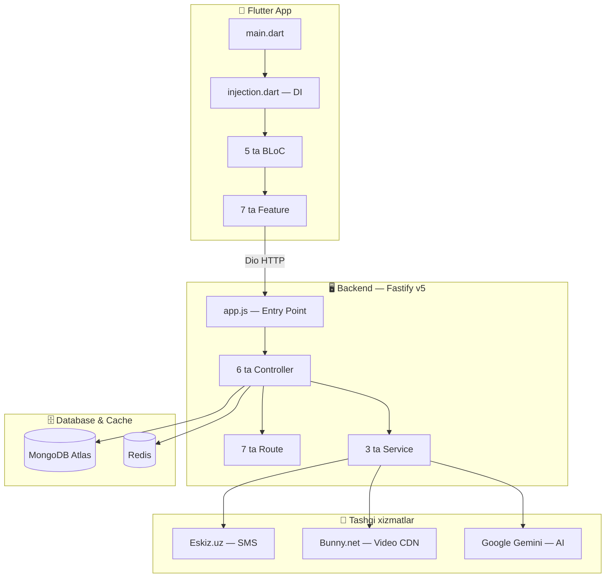
```mermaid
graph TB
    subgraph "📱 Flutter App"
        A["main.dart"]
        B["injection.dart — DI"]
        C["5 ta BLoC"]
        D["7 ta Feature"]
    end

    subgraph "🖥️ Backend — Fastify v5"
        E["app.js — Entry Point"]
        F["6 ta Controller"]
        G["7 ta Route"]
        H["3 ta Service"]
    end

    subgraph "🗄️ Database & Cache"
        I[("MongoDB Atlas")]
        J[("Redis")]
    end

    subgraph "🔌 Tashqi xizmatlar"
        K["Eskiz.uz — SMS"]
        L["Bunny.net — Video CDN"]
        M["Google Gemini — AI"]
    end

    A --> B --> C --> D
    D -->|"Dio HTTP"| E
    E --> F --> G
    F --> H
    H --> K & L & M
    F --> I & J
```

---

## 🚀 ISHLASH KETMA-KETLIGI (Step by Step)

### 1️⃣ Ilova ishga tushganda — `main.dart`

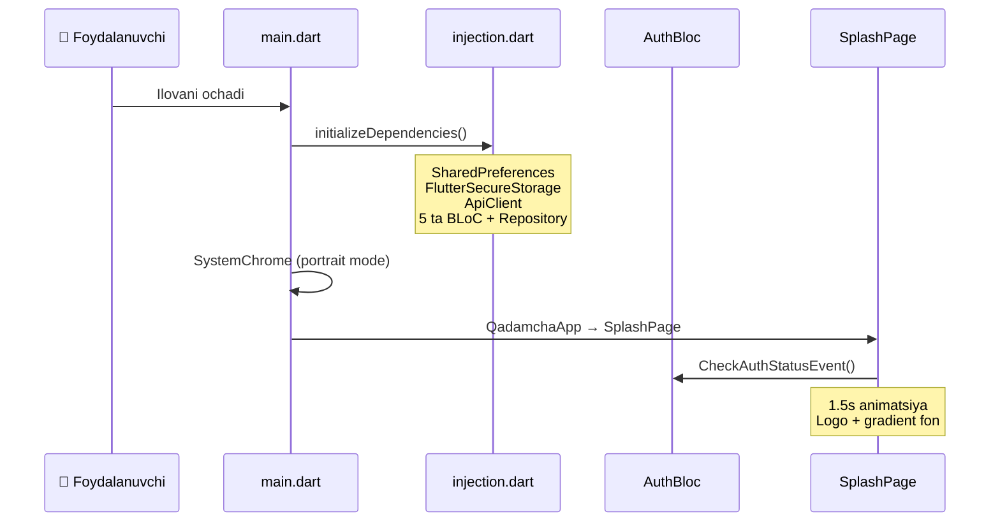
```mermaid
sequenceDiagram
    participant User as 📱 Foydalanuvchi
    participant Main as main.dart
    participant DI as injection.dart
    participant Bloc as AuthBloc
    participant Splash as SplashPage

    User->>Main: Ilovani ochadi
    Main->>DI: initializeDependencies()
    Note over DI: SharedPreferences<br>FlutterSecureStorage<br>ApiClient<br>5 ta BLoC + Repository
    Main->>Main: SystemChrome (portrait mode)
    Main->>Splash: QadamchaApp → SplashPage
    Splash->>Bloc: CheckAuthStatusEvent()
    Note over Splash: 1.5s animatsiya<br>Logo + gradient fon
```

**Ketma-ketlik:**
1. `WidgetsFlutterBinding.ensureInitialized()`
2. `initializeDependencies()` — barcha DI konteynerlarni sozlash
3. Portrait mode qulflanadi
4. `QadamchaApp` → `ScreenUtilInit(375x812)` → `MultiBlocProvider` → `MaterialApp`
5. Boshlang'ich sahifa: **SplashPage**

### 2️⃣ Splash Screen — Auth tekshirish

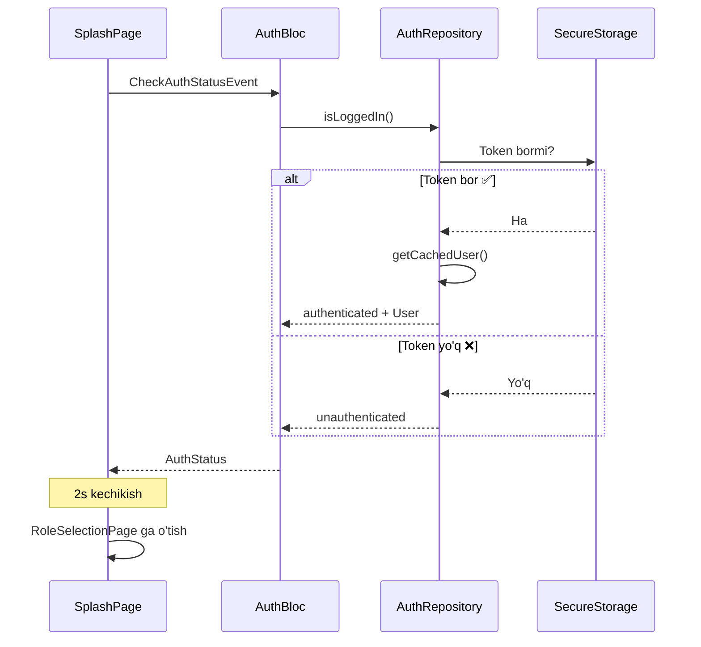
```mermaid
sequenceDiagram
    participant Splash as SplashPage
    participant Bloc as AuthBloc
    participant Repo as AuthRepository
    participant Storage as SecureStorage

    Splash->>Bloc: CheckAuthStatusEvent
    Bloc->>Repo: isLoggedIn()
    Repo->>Storage: Token bormi?
    alt Token bor ✅
        Storage-->>Repo: Ha
        Repo->>Repo: getCachedUser()
        Repo-->>Bloc: authenticated + User
    else Token yo'q ❌
        Storage-->>Repo: Yo'q
        Repo-->>Bloc: unauthenticated
    end
    Bloc-->>Splash: AuthStatus
    Note over Splash: 2s kechikish
    Splash->>Splash: RoleSelectionPage ga o'tish
```

**Natija:** Ikkala holatda ham → **RoleSelectionPage**

### 3️⃣ Rol tanlash — `RoleSelectionPage`

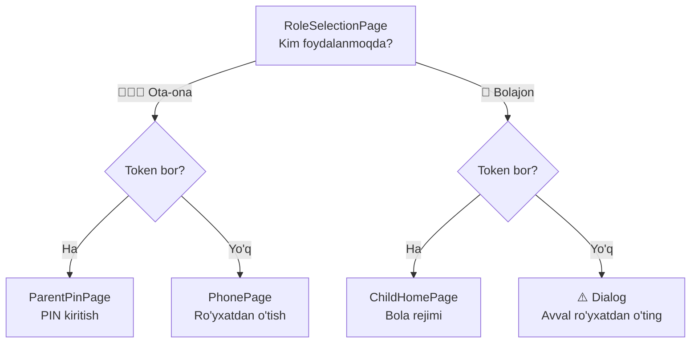
```mermaid
graph TD
    A["RoleSelectionPage<br>Kim foydalanmoqda?"]
    
    A -->|"👨‍👩‍👧 Ota-ona"| B{Token bor?}
    A -->|"👶 Bolajon"| C{Token bor?}
    
    B -->|Ha| D["ParentPinPage<br>PIN kiritish"]
    B -->|Yo'q| E["PhonePage<br>Ro'yxatdan o'tish"]
    
    C -->|Ha| F["ChildHomePage<br>Bola rejimi"]
    C -->|Yo'q| G["⚠️ Dialog<br>Avval ro'yxatdan o'ting"]
```

**Mantiq:**
- **Ota-ona tanlasa:**
  - Token **bor** → `ParentPinPage` (PIN tekshirish)
  - Token **yo'q** → `PhonePage` (ro'yxatdan o'tish)
- **Bola tanlasa:**
  - Token **bor** → `ChildHomePage` (to'g'ridan-to'g'ri)
  - Token **yo'q** → Ogohlantirish dialogi

### 4️⃣ Ro'yxatdan o'tish jarayoni (Yangi foydalanuvchi)

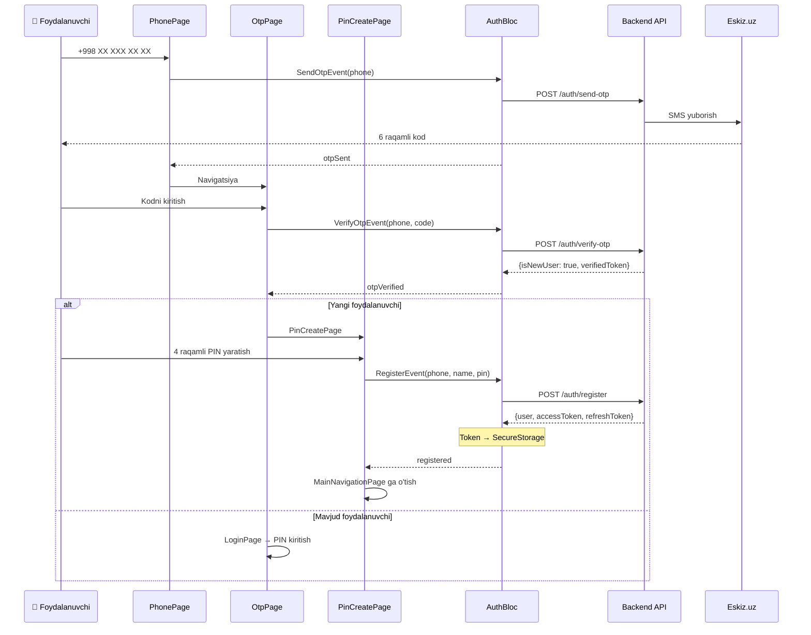
```mermaid
sequenceDiagram
    participant User as 📱 Foydalanuvchi
    participant Phone as PhonePage
    participant OTP as OtpPage
    participant PIN as PinCreatePage
    participant Bloc as AuthBloc
    participant API as Backend API
    participant SMS as Eskiz.uz

    User->>Phone: +998 XX XXX XX XX
    Phone->>Bloc: SendOtpEvent(phone)
    Bloc->>API: POST /auth/send-otp
    API->>SMS: SMS yuborish
    SMS-->>User: 6 raqamli kod
    Bloc-->>Phone: otpSent
    Phone->>OTP: Navigatsiya

    User->>OTP: Kodni kiritish
    OTP->>Bloc: VerifyOtpEvent(phone, code)
    Bloc->>API: POST /auth/verify-otp
    API-->>Bloc: {isNewUser: true, verifiedToken}
    Bloc-->>OTP: otpVerified

    alt Yangi foydalanuvchi
        OTP->>PIN: PinCreatePage
        User->>PIN: 4 raqamli PIN yaratish
        PIN->>Bloc: RegisterEvent(phone, name, pin)
        Bloc->>API: POST /auth/register
        API-->>Bloc: {user, accessToken, refreshToken}
        Note over Bloc: Token → SecureStorage
        Bloc-->>PIN: registered
        PIN->>PIN: MainNavigationPage ga o'tish
    else Mavjud foydalanuvchi
        OTP->>OTP: LoginPage → PIN kiritish
    end
```

**Qadamlar:**
1. **PhonePage** — `+998` prefiksi, 9 raqam kiritish
2. **OtpPage** — 6 raqamli SMS kod
3. **PinCreatePage** — 4 raqamli PIN yaratish (yangi) yoki PIN kiritish (mavjud)
4. **Register/Login** → JWT tokenlar saqlash → Bosh sahifaga o'tish

### 5️⃣ Login jarayoni (Mavjud foydalanuvchi)

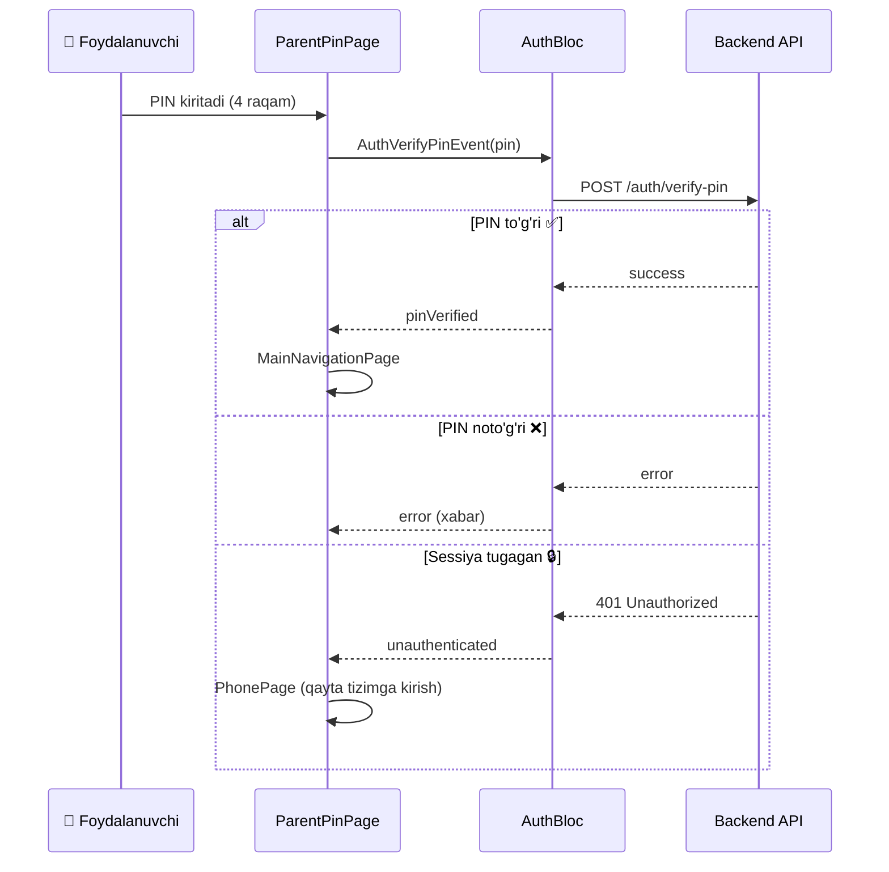
```mermaid
sequenceDiagram
    participant User as 📱 Foydalanuvchi
    participant PinPage as ParentPinPage
    participant Bloc as AuthBloc
    participant API as Backend API

    User->>PinPage: PIN kiritadi (4 raqam)
    PinPage->>Bloc: AuthVerifyPinEvent(pin)
    Bloc->>API: POST /auth/verify-pin
    
    alt PIN to'g'ri ✅
        API-->>Bloc: success
        Bloc-->>PinPage: pinVerified
        PinPage->>PinPage: MainNavigationPage
    else PIN noto'g'ri ❌
        API-->>Bloc: error
        Bloc-->>PinPage: error (xabar)
    else Sessiya tugagan 🔒
        API-->>Bloc: 401 Unauthorized
        Bloc-->>PinPage: unauthenticated
        PinPage->>PinPage: PhonePage (qayta tizimga kirish)
    end
```

### 6️⃣ Ota-ona bosh sahifasi — `MainNavigationPage`

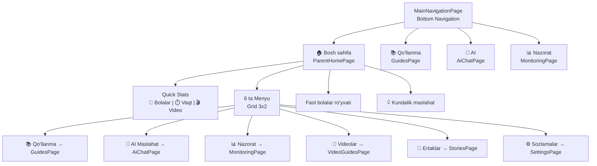
```mermaid
graph TD
    A["MainNavigationPage<br>Bottom Navigation"]
    
    A --> B["🏠 Bosh sahifa<br>ParentHomePage"]
    A --> C["📚 Qo'llanma<br>GuidesPage"]
    A --> D["🤖 AI<br>AiChatPage"]
    A --> E["📊 Nazorat<br>MonitoringPage"]
    
    B --> B1["Quick Stats<br>👧 Bolalar | ⏱️ Vaqt | 🎬 Video"]
    B --> B2["6 ta Menyu<br>Grid 3x2"]
    B --> B3["Faol bolalar ro'yxati"]
    B --> B4["💡 Kundalik maslahat"]
    
    B2 --> M1["📚 Qo'llanma → GuidesPage"]
    B2 --> M2["🤖 AI Maslahat → AiChatPage"]
    B2 --> M3["📊 Nazorat → MonitoringPage"]
    B2 --> M4["🎥 Videolar → VideoGuidesPage"]
    B2 --> M5["📖 Ertaklar → StoriesPage"]
    B2 --> M6["⚙️ Sozlamalar → SettingsPage"]
```

**ParentHomePage tarkibi:**
1. **Header** — Avatar, "Ota-ona paneli", Premium/Free badge
2. **Quick Stats** — gradient kartochka: Bolalar soni, Vaqt, Video
3. **6 ta menyu** — 3x2 grid: Qo'llanma, AI, Nazorat, Videolar, Ertaklar, Sozlamalar
4. **Faol bolalar** — har bir bola uchun: ism, ishlatilgan vaqt, status (🟢/⚪)
5. **Kundalik maslahat** — tarbiyaviy maslahat kartochka

### 7️⃣ Bola bosh sahifasi — `ChildHomePage`

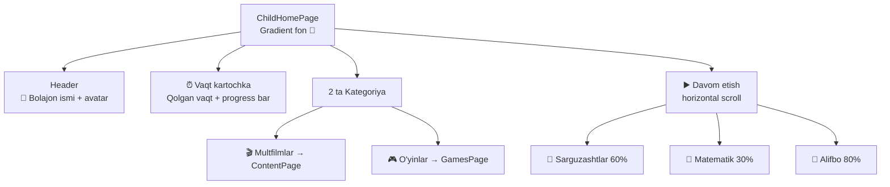
```mermaid
graph TD
    A["ChildHomePage<br>Gradient fon 🌈"]
    
    A --> B["Header<br>👶 Bolajon ismi + avatar"]
    A --> C["⏰ Vaqt kartochka<br>Qolgan vaqt + progress bar"]
    A --> D["2 ta Kategoriya"]
    A --> E["▶️ Davom etish<br>horizontal scroll"]
    
    D --> D1["🎬 Multfilmlar → ContentPage"]
    D --> D2["🎮 O'yinlar → GamesPage"]
    
    E --> E1["🦁 Sarguzashtlar 60%"]
    E --> E2["🔢 Matematik 30%"]
    E --> E3["📖 Alifbo 80%"]
```

**ChildHomePage tarkibi:**
1. **Header** — avatar, bola ismi, sozlamalar tugmasi
2. **Vaqt kartochka** — bugungi limit, ishlatilgan/qolgan daqiqalar
3. **2 ta katta kategoriya** — Multfilmlar (100+) va O'yinlar (50+)
4. **Davom etish** — horizontal carousel, progress bilan

---

## 🔄 Backend API Flow

### Auth Flow (Backend tomoni)

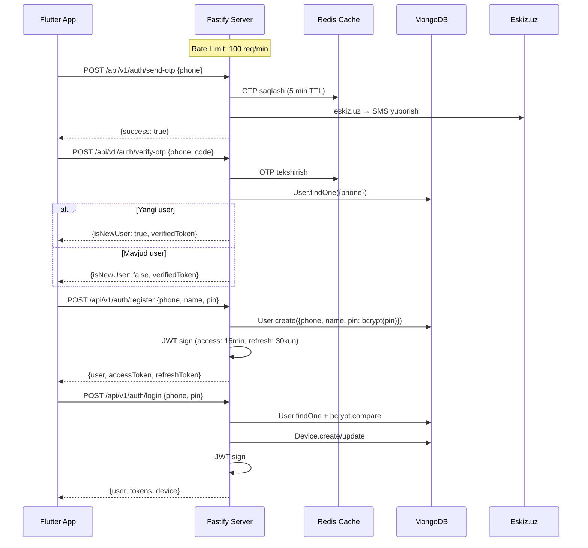
```mermaid
sequenceDiagram
    participant App as Flutter App
    participant API as Fastify Server
    participant Redis as Redis Cache
    participant DB as MongoDB
    participant SMS as Eskiz.uz

    Note over API: Rate Limit: 100 req/min

    App->>API: POST /api/v1/auth/send-otp {phone}
    API->>Redis: OTP saqlash (5 min TTL)
    API->>SMS: eskiz.uz → SMS yuborish
    API-->>App: {success: true}

    App->>API: POST /api/v1/auth/verify-otp {phone, code}
    API->>Redis: OTP tekshirish
    API->>DB: User.findOne({phone})
    alt Yangi user
        API-->>App: {isNewUser: true, verifiedToken}
    else Mavjud user
        API-->>App: {isNewUser: false, verifiedToken}
    end

    App->>API: POST /api/v1/auth/register {phone, name, pin}
    API->>DB: User.create({phone, name, pin: bcrypt(pin)})
    API->>API: JWT sign (access: 15min, refresh: 30kun)
    API-->>App: {user, accessToken, refreshToken}

    App->>API: POST /api/v1/auth/login {phone, pin}
    API->>DB: User.findOne + bcrypt.compare
    API->>DB: Device.create/update
    API->>API: JWT sign
    API-->>App: {user, tokens, device}
```

### Content Flow

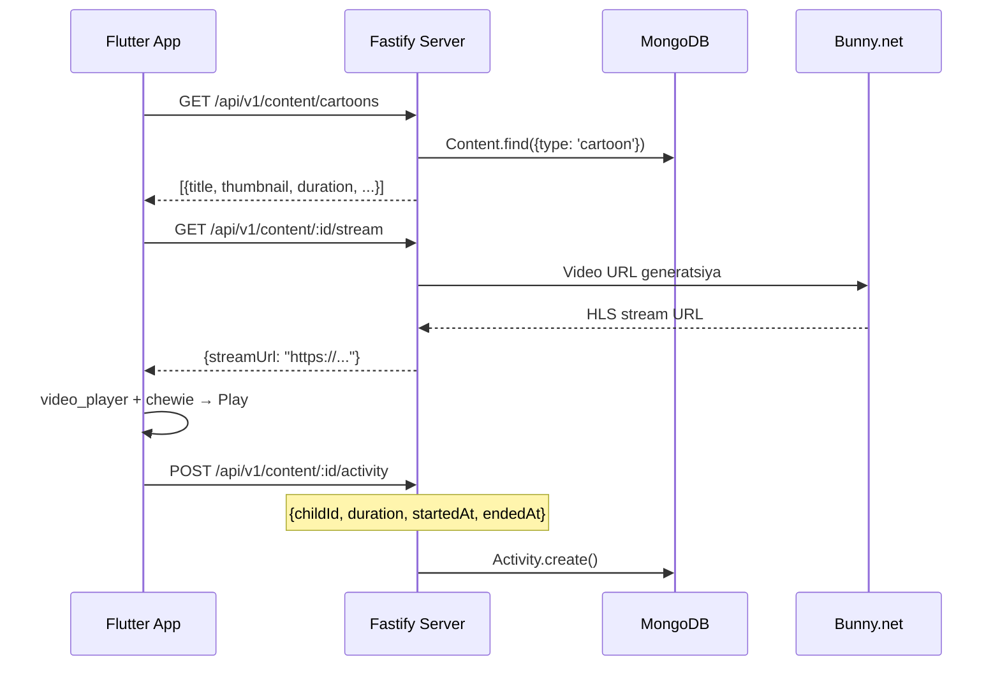
```mermaid
sequenceDiagram
    participant App as Flutter App
    participant API as Fastify Server
    participant DB as MongoDB
    participant CDN as Bunny.net

    App->>API: GET /api/v1/content/cartoons
    API->>DB: Content.find({type: 'cartoon'})
    API-->>App: [{title, thumbnail, duration, ...}]

    App->>API: GET /api/v1/content/:id/stream
    API->>CDN: Video URL generatsiya
    CDN-->>API: HLS stream URL
    API-->>App: {streamUrl: "https://..."}

    App->>App: video_player + chewie → Play
    
    App->>API: POST /api/v1/content/:id/activity
    Note over API: {childId, duration, startedAt, endedAt}
    API->>DB: Activity.create()
```

---

## 🗄️ Database Schema

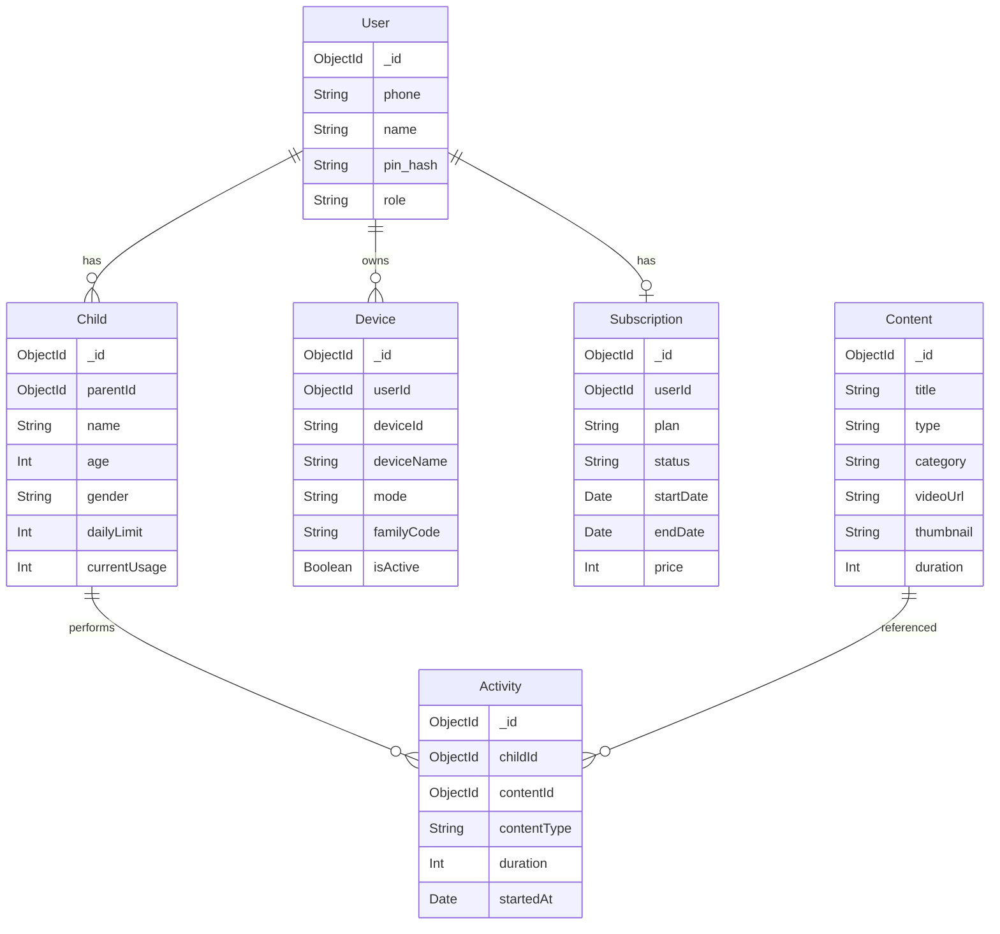
```mermaid
erDiagram
    User ||--o{ Child : "has"
    User ||--o{ Device : "owns"
    User ||--o| Subscription : "has"
    Child ||--o{ Activity : "performs"
    Content ||--o{ Activity : "referenced"

    User {
        ObjectId _id
        String phone
        String name
        String pin_hash
        String role
    }

    Child {
        ObjectId _id
        ObjectId parentId
        String name
        Int age
        String gender
        Int dailyLimit
        Int currentUsage
    }

    Device {
        ObjectId _id
        ObjectId userId
        String deviceId
        String deviceName
        String mode
        String familyCode
        Boolean isActive
    }

    Subscription {
        ObjectId _id
        ObjectId userId
        String plan
        String status
        Date startDate
        Date endDate
        Int price
    }

    Content {
        ObjectId _id
        String title
        String type
        String category
        String videoUrl
        String thumbnail
        Int duration
    }

    Activity {
        ObjectId _id
        ObjectId childId
        ObjectId contentId
        String contentType
        Int duration
        Date startedAt
    }
```

---

## 🧩 Clean Architecture Qatlamlari

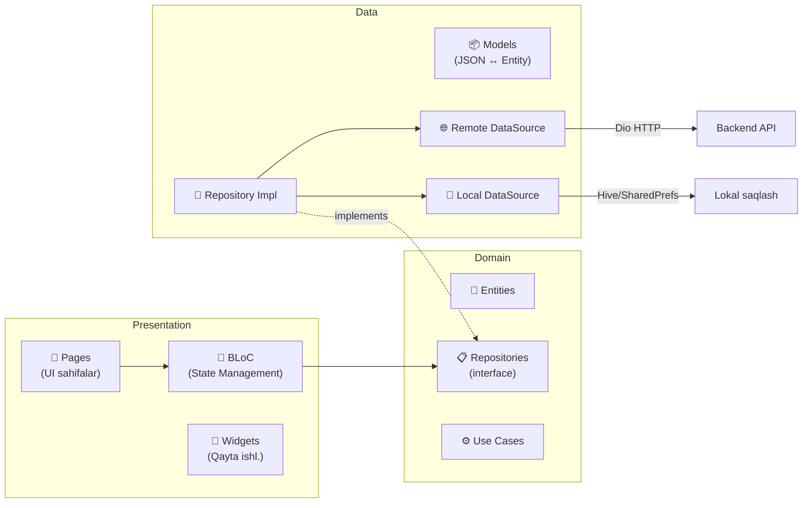
```mermaid
graph LR
    subgraph "Presentation"
        direction TB
        P1["📄 Pages<br>(UI sahifalar)"]
        P2["🔄 BLoC<br>(State Management)"]
        P3["🧱 Widgets<br>(Qayta ishl.)"]
    end

    subgraph "Domain"
        direction TB
        D1["📐 Entities"]
        D2["📋 Repositories<br>(interface)"]
        D3["⚙️ Use Cases"]
    end

    subgraph "Data"
        direction TB
        DA1["📦 Models<br>(JSON ↔ Entity)"]
        DA2["🔌 Repository Impl"]
        DA3["🌐 Remote DataSource"]
        DA4["💾 Local DataSource"]
    end

    P1 --> P2
    P2 --> D2
    DA2 -.->|implements| D2
    DA2 --> DA3
    DA2 --> DA4
    DA3 -->|"Dio HTTP"| API["Backend API"]
    DA4 -->|"Hive/SharedPrefs"| Local["Lokal saqlash"]
```

**Har bir feature (misol: Auth):**
```
features/auth/
├── data/
│   ├── datasources/
│   │   ├── auth_remote_datasource.dart  → API chaqirish
│   │   └── auth_local_datasource.dart   → Token saqlash
│   ├── models/auth_models.dart          → JSON parsing
│   └── repositories/auth_repository_impl.dart
├── domain/
│   ├── entities/user_entity.dart        → Toza modellar
│   ├── repositories/auth_repository.dart → Interface
│   └── usecases/auth_usecases.dart
└── presentation/
    ├── bloc/
    │   ├── auth_bloc.dart    → 9 ta event handler
    │   ├── auth_event.dart
    │   └── auth_state.dart
    ├── pages/               → 10 ta sahifa
    └── widgets/             → 4 ta widget
```

---

## 🔗 Dependency Injection — `injection.dart`

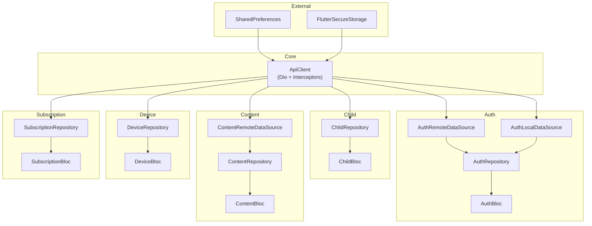
```mermaid
graph TD
    subgraph "External"
        SP["SharedPreferences"]
        FSS["FlutterSecureStorage"]
    end

    subgraph "Core"
        AC["ApiClient<br>(Dio + Interceptors)"]
    end

    subgraph "Auth"
        ARD["AuthRemoteDataSource"]
        ALD["AuthLocalDataSource"]
        AR["AuthRepository"]
        AB["AuthBloc"]
    end

    subgraph "Child"
        CR["ChildRepository"]
        CB["ChildBloc"]
    end

    subgraph "Content"
        CRDS["ContentRemoteDataSource"]
        COR["ContentRepository"]
        COB["ContentBloc"]
    end

    subgraph "Device"
        DR["DeviceRepository"]
        DB["DeviceBloc"]
    end

    subgraph "Subscription"
        SR["SubscriptionRepository"]
        SB["SubscriptionBloc"]
    end

    SP & FSS --> AC
    AC --> ARD & ALD
    ARD & ALD --> AR --> AB
    AC --> CR --> CB
    AC --> CRDS --> COR --> COB
    AC --> DR --> DB
    AC --> SR --> SB
```

---

## 🛡️ Xavfsizlik Ketma-ketligi

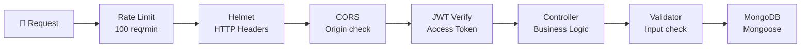
```mermaid
graph LR
    A["📱 Request"] --> B["Rate Limit<br>100 req/min"]
    B --> C["Helmet<br>HTTP Headers"]
    C --> D["CORS<br>Origin check"]
    D --> E["JWT Verify<br>Access Token"]
    E --> F["Controller<br>Business Logic"]
    F --> G["Validator<br>Input check"]
    G --> H["MongoDB<br>Mongoose"]
```

**JWT Tokenlar:**
| Token | Muddati | Vazifasi |
|-------|---------|----------|
| Access Token | 15 daqiqa | API so'rovlar uchun |
| Refresh Token | 30 kun | Yangi access token olish |

**PIN xavfsizligi:** bcrypt hashing — serverda saqlanadi, plain text yo'q.

---

## 📱 Ekranlar Xaritasi (Screen Map)

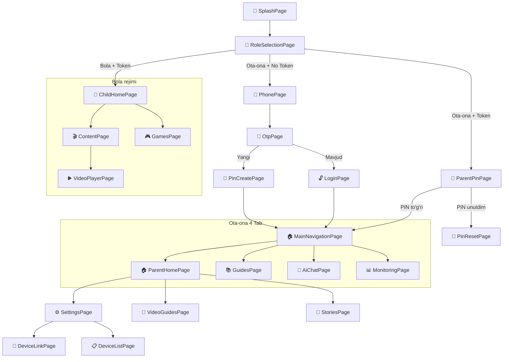
```mermaid
graph TD
    S["🌟 SplashPage"] --> R["👥 RoleSelectionPage"]
    
    R -->|"Ota-ona + Token"| PP["🔐 ParentPinPage"]
    R -->|"Ota-ona + No Token"| PH["📱 PhonePage"]
    R -->|"Bola + Token"| CH["👶 ChildHomePage"]
    
    PH --> OTP["🔢 OtpPage"]
    OTP -->|"Yangi"| PC["🔑 PinCreatePage"]
    OTP -->|"Mavjud"| LP["🔓 LoginPage"]
    PC --> MN
    LP --> MN
    
    PP -->|"PIN to'g'ri"| MN["🏠 MainNavigationPage"]
    PP -->|"PIN unutdim"| PR["🔄 PinResetPage"]
    
    subgraph "Ota-ona 4 Tab"
        MN --> T1["🏠 ParentHomePage"]
        MN --> T2["📚 GuidesPage"]
        MN --> T3["🤖 AiChatPage"]
        MN --> T4["📊 MonitoringPage"]
    end
    
    T1 --> SET["⚙️ SettingsPage"]
    T1 --> VG["🎥 VideoGuidesPage"]
    T1 --> ST["📖 StoriesPage"]
    
    subgraph "Bola rejimi"
        CH --> CP["🎬 ContentPage"]
        CH --> GP["🎮 GamesPage"]
        CP --> VP["▶️ VideoPlayerPage"]
    end
    
    SET --> DL["📱 DeviceLinkPage"]
    SET --> DLP["📋 DeviceListPage"]
```

---

## ⚡ Ma'lumot Oqimi (Data Flow)

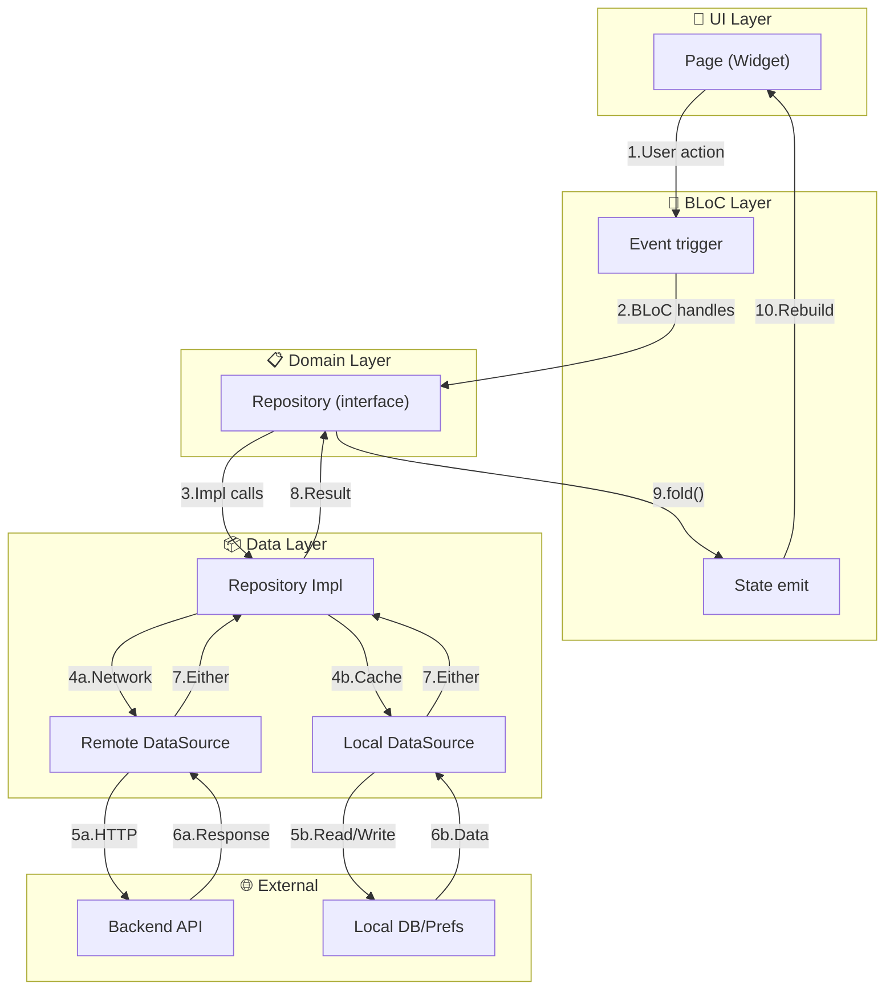
```mermaid
graph TD
    subgraph "📱 UI Layer"
        Page["Page (Widget)"]
    end

    subgraph "🔄 BLoC Layer"
        Event["Event trigger"]
        State["State emit"]
    end

    subgraph "📋 Domain Layer"
        Repo["Repository (interface)"]
    end

    subgraph "📦 Data Layer"
        Impl["Repository Impl"]
        Remote["Remote DataSource"]
        Local["Local DataSource"]
    end

    subgraph "🌐 External"
        API["Backend API"]
        DB["Local DB/Prefs"]
    end

    Page -->|"1.User action"| Event
    Event -->|"2.BLoC handles"| Repo
    Repo -->|"3.Impl calls"| Impl
    Impl -->|"4a.Network"| Remote
    Impl -->|"4b.Cache"| Local
    Remote -->|"5a.HTTP"| API
    Local -->|"5b.Read/Write"| DB
    API -->|"6a.Response"| Remote
    DB -->|"6b.Data"| Local
    Remote & Local -->|"7.Either"| Impl
    Impl -->|"8.Result"| Repo
    Repo -->|"9.fold()"| State
    State -->|"10.Rebuild"| Page
```

**10 qadam:**
1. Foydalanuvchi tugmani bosadi → Event
2. BLoC eventni ushlaydi
3. Repository interface orqali chaqiradi
4. Impl remote yoki local datasource ni chaqiradi
5. HTTP so'rov yoki lokal o'qish
6. Javob qaytadi
7. `Either<Failure, Success>` formatda
8. Repository natijani qaytaradi
9. BLoC `fold()` orqali state emit qiladi
10. UI qayta quriladi (BlocBuilder)

---

## 🔄 Obuna Tizimi

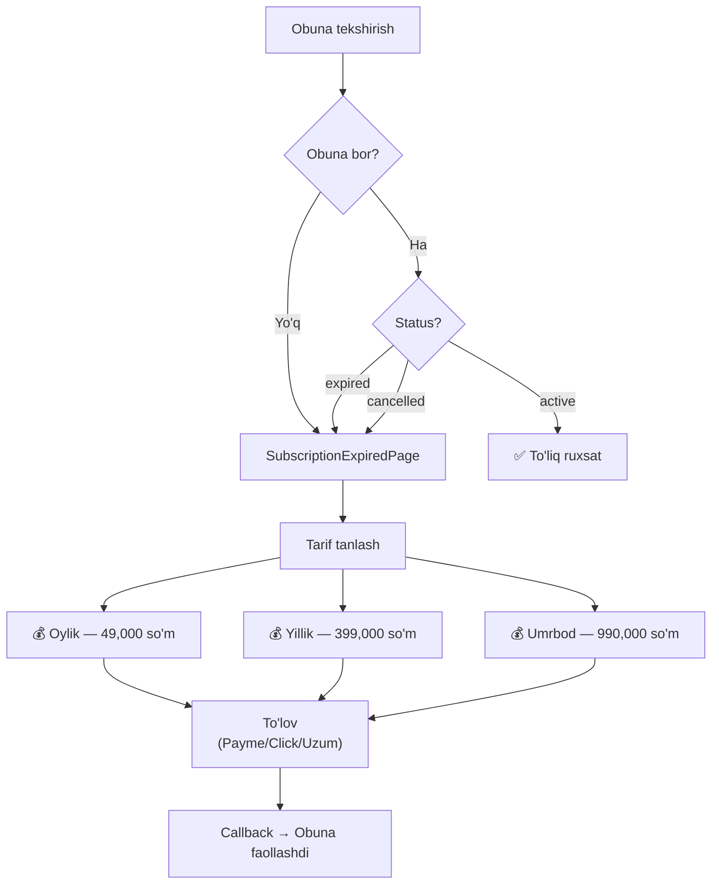
```mermaid
graph TD
    A["Obuna tekshirish"] --> B{Obuna bor?}
    B -->|Ha| C{Status?}
    B -->|Yo'q| D["SubscriptionExpiredPage"]
    
    C -->|active| E["✅ To'liq ruxsat"]
    C -->|expired| D
    C -->|cancelled| D
    
    D --> F["Tarif tanlash"]
    F --> G["💰 Oylik — 49,000 so'm"]
    F --> H["💰 Yillik — 399,000 so'm"]
    F --> I["💰 Umrbod — 990,000 so'm"]
    
    G & H & I --> J["To'lov<br>(Payme/Click/Uzum)"]
    J --> K["Callback → Obuna faollashdi"]
```

---

## 📡 Backend Arxitekturasi


```mermaid
graph TD
    subgraph "Entry"
        A["app.js"]
    end

    subgraph "Plugins"
        B1["@fastify/cors"]
        B2["@fastify/helmet"]
        B3["@fastify/jwt"]
        B4["@fastify/rate-limit"]
        B5["@fastify/swagger"]
    end

    subgraph "Middleware"
        C1["logger.middleware"]
        C2["validator.middleware"]
        C3["authenticate decorator"]
    end

    subgraph "Routes → Controllers"
        D1["/auth → auth.controller"]
        D2["/children → children.controller"]
        D3["/devices → devices.controller"]
        D4["/content → content.controller"]
        D5["/subscription → subscription.controller"]
        D6["/ai → ai.controller"]
    end

    subgraph "Services"
        E1["sms.service → Eskiz.uz"]
        E2["video.service → Bunny.net"]
        E3["ai.service → Google Gemini"]
    end

    subgraph "Models"
        F1["User"] & F2["Child"] & F3["Device"]
        F4["Subscription"] & F5["Content"] & F6["Activity"]
    end

    A --> B1 & B2 & B3 & B4 & B5
    A --> C1 & C2 & C3
    A --> D1 & D2 & D3 & D4 & D5 & D6
    D1 --> E1
    D4 --> E2
    D6 --> E3
    D1 & D2 & D3 & D4 & D5 & D6 --> F1 & F2 & F3 & F4 & F5 & F6
```

---

## 📊 Statistika

| Ko'rsatkich | Qiymat |
|-------------|--------|
| Flutter Dart fayllar | **96 ta** |
| Feature modullar | **7 ta** (auth, child, content, device, home, subscription, ai_chat) |
| BLoC'lar | **5 ta** (Auth, Child, Content, Device, Subscription) |
| Sahifalar | **~20 ta** |
| Backend Controllers | **6 ta** |
| API Route guruhlari | **6 ta** |
| Mongoose Modellar | **6 ta** |
| Tashqi integratsiyalar | **3 ta** (SMS, Video, AI) |
